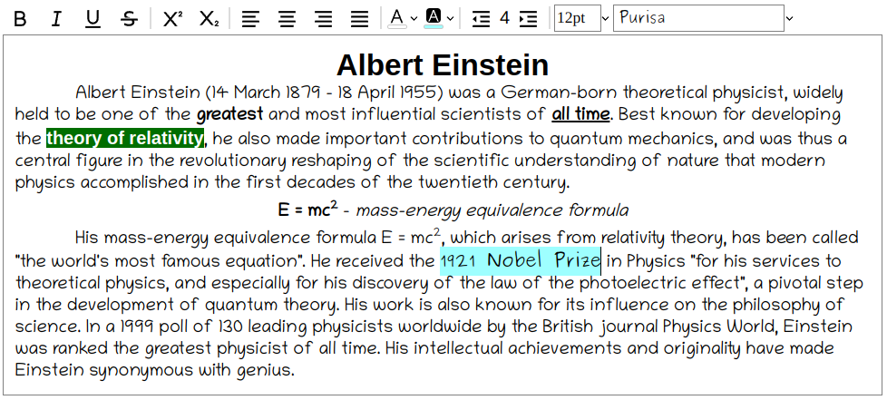

# Textolite

Textolite is a simle text editor.



## Using

In order to install package use  ```npm iinstall textolite``` .

```JavaScript
import { Editor } from 'textolite';
const editor = new Editor("editor-container");
```
For now editor still doesn't support json export, so the easiest method of getting inserted text is to read innerHTML property of editor container.

```JavaScript
const html = editor.getHTML();
```

Please find example of usage below.

## Example

In order to run exemple:
1. Compile typescript files to js using ```tsc```.
2. Create global link to package using ```npm-link```. 
3. Go to example folder.
4. Link local library to project ```npm-link textolite```.
5. Run example with ```npm run```.

## Running tests

In order to run tests run ```npm test```.<br/>
In order to show coverage details use *coverage* option: ```npm test -- --coverage```.
